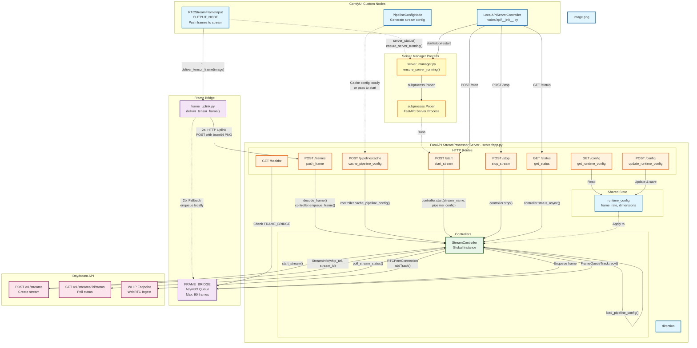

# RTC Node Architecture

## StreamProcessor & Custom Nodes Communication



## Component Details

### Custom Nodes

#### RTCStreamFrameInput (Frame Output Node)
```python
Category: "RTC Stream"
Display Name: "RTC Stream Frame Input"
Inputs: IMAGE, enabled
Outputs: None (OUTPUT_NODE)
```
**Function**: Pushes ComfyUI IMAGE tensors to the streaming pipeline
- **Primary path**: HTTP uplink via `POST /frames` (base64 PNG)
- **Fallback path**: Direct enqueue to `FRAME_BRIDGE` if server unavailable
- Uses `deliver_tensor_frame()` which tries HTTP first, falls back to local queue

#### RTCStreamFrameOutput (Frame Input Node)
```python
Category: "RTC Stream"
Display Name: "RTC Stream Frame Output"
Inputs: whep_url
Outputs: IMAGE
```
**Function**: Pulls frames from WHEP subscriber
- Auto-connects to WHEP if not already subscribed
- Fetches latest frame via `GET /whep/frame`
- Returns blank tensor if no frame available
- Always executes (`IS_CHANGED` returns `True`)

#### StartRTCStream (Stream Initialization Node)
```python
Category: "RTC Stream"
Display Name: "Start RTC Stream"
Inputs: pipeline_config (PIPELINE_CONFIG), stream_name (STRING), fps (INT), width (INT), height (INT), enabled (BOOLEAN), stop_stream (BOOLEAN)
Outputs: stream_id (STRING), playback_id (STRING), whip_url (STRING)
OUTPUT_NODE: True
```
**Function**: Starts a Daydream stream with pipeline configuration
- **Output node**: Executes on every workflow run as a terminal effect (outputs are optional)
- **Stream settings**: Specifies FPS (1-120), width (64-4096), and height (64-4096) for the stream processor
- **Connectable dimensions**: Width/height can be connected from PipelineConfigNode outputs to ensure matching sizes
- **Enable/disable**: `enabled` toggle allows temporarily skipping stream operations while returning cached results
- **Smart caching**: Uses `hash_pipeline_config()` plus stream settings so ComfyUI caches starts per config
- **Reuse existing**: If a stream is already running, returns its info
- **Manual stop**: `stop_stream` toggle issues `POST /stop`, clears cache, auto-resets widget
- **Blocking operation**: Waits for stream creation to complete
- **Toast notifications**: Sends success/error messages to frontend
- **Backend-focused**: Minimal logic in node, delegates to local API server
- Returns stream identifiers for use by other nodes (optional - can be left unconnected)

#### UpdateRTCStream (Stream Parameter Update Node)
```python
Category: "RTC Stream"
Display Name: "Update RTC Stream"
Inputs: pipeline_config (PIPELINE_CONFIG)
Outputs: None
OUTPUT_NODE: True
```
- **Function**: Updates pipeline parameters for a running stream
- **Change detection**: Uses shared `hash_pipeline_config()` helper (only config diffs trigger)
- **Live updates**: Uses `PATCH /pipeline` endpoint after querying `/status`
- **No outputs**: Node performs side effects only (notifications, no payload)
- **Graceful errors**: Handles 405 (not supported), 409 (no stream) appropriately
- **Enable toggle**: Optional boolean input stops execution while disabled and caches that state

#### RTCStreamStatus (Status Monitoring Node)
```python
Category: "RTC Stream"
Display Name: "RTC Stream Status"
Inputs: stream_id (STRING, optional), refresh_interval (FLOAT, optional, default=5.0)
Outputs: running (BOOLEAN), stream_id (STRING), playback_id (STRING), 
         whip_url (STRING), frames_sent (INT), queue_depth (INT), status_json (STRING)
```
**Function**: Retrieves and caches stream status from local API server
- **Workflow dependency**: Accepts `stream_id` input to control execution order
  - Creates dependency on Start RTC Stream node in workflow graph
  - Node executes after Start node completes
  - stream_id changes immediately invalidate cache so status reflects new sessions
- **Time-based caching**: Uses `refresh_interval` to control update frequency
- **Smart refresh**: Only fetches new status when interval expires
- **No-cache mode**: Setting `refresh_interval=0` disables caching entirely
- **Fallback on error**: Uses cached data if fetch fails
- **Performance metrics**: Exposes frames_sent and queue_depth
- **Full data access**: Provides complete status as JSON for custom processing
- Uses `IS_CHANGED()` to trigger ComfyUI re-execution based on time

#### PipelineConfigNode
```python
Category: "Daydream Live/Config"
Outputs: PIPELINE_CONFIG (dict), config_json (str), width (INT), height (INT)
```
**Function**: Generates validated Daydream stream configuration
- Validates model/ControlNet compatibility
- Enforces parameter constraints
- Can cache config to disk via `POST /pipeline/cache`
- Returns both dict (for nodes) and JSON preview (for inspection)
- Outputs width/height separately so they can be connected to Start RTC Stream node
- Exposes `hash_pipeline_config()` for Start/Update nodes to share deterministic caching

#### LocalAPIServerController
```python
Location: nodes/api/__init__.py
Endpoint: /rtc/control (on ComfyUI PromptServer)
```
**Function**: Exposes server lifecycle controls to ComfyUI frontend
- `start`: Launch FastAPI server process
- `stop`: Terminate server
- `restart`: Stop + Start
- `status`: Query server state
- Delegates to `server_manager.py`

### FastAPI StreamProcessor Routes

| Route | Method | Handler | Purpose |
|-------|--------|---------|---------|
| `/healthz` | GET | `healthz()` | Health check (queue depth, loop status) |
| `/start` | POST | `start_stream(req)` | Create Daydream stream & begin WHIP |
| `/stop` | POST | `stop_stream()` | Terminate streaming session |
| `/status` | GET | `get_status()` | Query StreamController state |
| `/frames` | POST | `push_frame(payload)` | Ingest base64 PNG frame |
| `/config` | GET | `get_runtime_config()` | Read frame_rate, dimensions |
| `/config` | POST | `update_runtime_config(payload)` | Update settings (blocked while streaming) |
| `/pipeline/cache` | POST | `cache_pipeline_config(payload)` | Persist config to disk |
| `/pipeline` | PATCH | `update_pipeline(payload)` | Update pipeline params on running stream |
| `/whep/connect` | POST | `connect_whep(payload)` | Subscribe to WHEP playback |
| `/whep/disconnect` | POST | `disconnect_whep()` | Close WHEP subscription |
| `/whep/status` | GET | `get_whep_status()` | WHEP connection state |
| `/whep/frame` | GET | `fetch_whep_frame()` | Latest frame from WHEP |

### Controllers

#### StreamController
```python
Location: rtc_stream/controller.py
State: ControllerState (StreamInfo, frames_sent, running)
```
**Responsibilities**:
- Load/cache pipeline configuration
- Call Daydream API to create stream
- Establish WHIP WebRTC connection
- Manage `FrameQueueTrack` (pulls from `FRAME_BRIDGE`)
- Poll remote stream status
- Track frames sent via PTS counter

**Key Methods**:
- `start(stream_name, pipeline_override)` → Dict
- `stop()` → Dict
- `status_async(refresh_remote)` → Dict
- `enqueue_frame(frame: np.ndarray)` → None
- `update_pipeline(pipeline_config)` → Dict

#### WhepController
```python
Location: rtc_stream/whep_controller.py
State: WhepControllerState (whep_url, connected, frames_received)
```
**Responsibilities**:
- Subscribe to WHEP endpoint (WebRTC playback)
- Receive video frames from remote stream
- Store frames in `WHEP_FRAME_BRIDGE`
- Manage connection lifecycle

**Key Methods**:
- `connect(whep_url)` → Dict
- `disconnect()` → Dict
- `status()` → Dict

### Server Manager

#### server_manager.py
```python
Functions:
- ensure_server_running(host_override, port_override) → bool
- stop_server() → bool
- server_status() → dict
```
**Process Management**:
1. Checks if server already running
2. Cleans up orphan processes from previous crashes
3. Finds available port (tries base_port + 0..7)
4. Launches `subprocess.Popen` with FastAPI app
5. Waits for port to become available
6. Persists state to `settings/local_api_server_state.json`
7. Relays stdout/stderr to logger

**Environment Variables**:
- `DAYDREAM_API_URL` - API endpoint (default: https://api.daydream.live)
- `DAYDREAM_API_KEY` - Authentication token

## Data Flow Examples

### Example 1: Frame Streaming (Custom Node → Daydream)

```
1. User executes ComfyUI workflow with RTCStreamFrameInput
2. RTCStreamFrameInput.push_frame(image) called
3. deliver_tensor_frame(image) converts tensor to uint8 numpy
4. HTTP POST /frames with base64 PNG payload
5. Server: decode_frame() → np.ndarray
6. controller.enqueue_frame() → FRAME_BRIDGE.enqueue()
7. FrameQueueTrack.recv() pulls from FRAME_BRIDGE
8. Converts to av.VideoFrame with monotonic PTS
9. RTCPeerConnection streams to WHIP endpoint
10. Daydream processes frame in pipeline
```

### Example 2: WHEP Playback (Daydream → Custom Node)

```
1. User adds RTCStreamFrameOutput node with whep_url
2. Node checks GET /whep/status
3. If not connected: POST /whep/connect
4. WhepController subscribes to WHEP (WebRTC SDP exchange)
5. Receives video track frames
6. Stores in WHEP_FRAME_BRIDGE
7. Node polls GET /whep/frame
8. Server returns latest frame as base64 PNG
9. Node decodes to torch.Tensor
10. Tensor flows through rest of workflow
```

### Example 3: Stream Lifecycle Control

```
1. User clicks "Start Stream" in ComfyUI UI
2. Frontend calls POST /rtc/control {"action": "start"}
3. LocalAPIServerController.start() called
4. Delegates to server_manager.ensure_server_running()
5. Launches FastAPI server subprocess if needed
6. Frontend calls POST {server_url}/start with pipeline config
7. StreamController.start() creates Daydream stream
8. Daydream API returns WHIP URL
9. StreamController establishes WebRTC connection
10. FrameQueueTrack begins streaming frames
11. User clicks "Stop Stream"
12. POST /stop → controller.stop()
13. Cancels background task, closes peer connection
```

### Example 4: Node-Based Stream Creation with Caching

```
1. User adds StartRTCStream node with PipelineConfig input
2. First workflow execution:
   a. Node computes cache key from pipeline_config
   b. No cached result exists
   c. Checks GET /status - no stream running
   d. Calls POST /start with pipeline_config
   e. StreamController creates Daydream stream
   f. Node caches (stream_id, playback_id, whip_url)
   g. Sends "rtc-stream-notification" to frontend
   h. Frontend shows toast: "Stream Started"
   i. Returns stream info to workflow
3. Second workflow execution (same config):
   a. Node computes same cache key
   b. ComfyUI sees cache key unchanged → uses cached output
   c. Node doesn't execute, workflow uses cached stream info
   d. No duplicate stream created
4. Workflow execution with different config:
   a. Cache key differs
   b. Checks GET /status - stream exists
   c. Returns existing stream info
   d. Caches new result
   e. Toast: "Stream Already Running"
```

### Example 5: Status Monitoring with Time-Based Caching

```
1. User adds RTCStreamStatus node with refresh_interval=5.0

2. First execution (t=0s):
   a. IS_CHANGED() returns floor(time/5.0) = 0
   b. Node executes get_status()
   c. Checks: current_time - last_refresh_time = 0 - 0 = infinite
   d. Triggers fetch: GET /status
   e. Caches response, sets last_refresh_time = 0s
   f. Returns: running=True, stream_id="abc123", frames_sent=100, etc.

3. Second execution (t=2s):
   a. IS_CHANGED() returns floor(2/5.0) = 0 (same as before)
   b. ComfyUI uses cached output from first execution
   c. Node doesn't execute at all

4. Third execution (t=6s):
   a. IS_CHANGED() returns floor(6/5.0) = 1 (different!)
   b. ComfyUI detects change, re-executes node
   c. Checks: current_time - last_refresh_time = 6 - 0 = 6s
   d. 6s >= 5s interval → triggers fetch
   e. GET /status called
   f. Caches new response, sets last_refresh_time = 6s
   g. Returns: frames_sent=500 (updated value)

5. Fourth execution (t=8s):
   a. IS_CHANGED() returns floor(8/5.0) = 1 (same as third)
   b. ComfyUI uses cached output from third execution
   c. Node doesn't execute

6. Fifth execution with refresh_interval=0 (t=10s):
   a. IS_CHANGED() returns current timestamp (always unique)
   b. ComfyUI always re-executes
   c. Checks: refresh_interval=0 → always refresh
   d. GET /status called every time
   e. No caching occurs
```

**Key Insights**:
- **Double caching**: ComfyUI's execution cache + node's internal time-based cache
- **Efficiency**: With interval=5s and 100 executions/minute, only ~12 API calls made
- **Flexibility**: refresh_interval=0 for real-time, higher values for efficiency
- **Resilience**: Falls back to cached data if API call fails

### Example 6: Live Parameter Updates with UpdateRTCStream

```
1. User builds workflow:
   ├─ PipelineConfig A (prompt="sunset") → StartRTCStream → stream_id
   ├─ PipelineConfig B (prompt="sunset") → UpdateRTCStream(stream_id)
   └─ RTCStreamFrameOutput sends frames

2. First execution:
   a. PipelineConfig A outputs, cached by ComfyUI
   b. StartRTCStream creates stream, outputs stream_id
   c. PipelineConfig B outputs (same as A initially)
   d. UpdateRTCStream computes hash of config B + seed
   e. No change detected → doesn't execute
   f. Stream runs with "sunset" prompt

3. User changes PipelineConfig B prompt to "cyberpunk":
   a. PipelineConfig B outputs new config
   b. ComfyUI detects output changed
   c. UpdateRTCStream.IS_CHANGED() computes new hash
   d. Hash differs → node executes
   e. Calls PATCH /pipeline with new config
   f. StreamController.update_pipeline() forwards to Daydream
   g. Daydream updates running stream parameters
   h. Toast: "Pipeline Updated"
   i. Stream now renders "cyberpunk" prompt
   j. No stream restart needed

4. Subsequent executions with same "cyberpunk" config:
   a. PipelineConfig B output unchanged
   b. UpdateRTCStream hash unchanged
   c. ComfyUI uses cached result
   d. Node doesn't execute (optimal)
   e. Stream continues with current parameters

5. User enables control_after_generate:
   a. Right-click UpdateRTCStream → Properties
   b. Set "control_after_generate" to "randomize"
   c. Run workflow with same config
   d. After execution, seed auto-randomizes (e.g., 42 → 918273645)
   e. Next execution: hash differs due to new seed
   f. Node executes and updates stream
   g. Forces continuous updates without manual intervention
```

### Example 7: Continuous Parameter Exploration with Randomization

```
1. Setup for continuous exploration:
   ├─ PipelineConfig (prompt="futuristic city")
   ├─ UpdateRTCStream with control_after_generate="randomize"
   └─ Workflow runs in loop/queue

2. First execution (seed=100):
   a. UpdateRTCStream.IS_CHANGED() → hash("config:100")
   b. Node executes, updates stream
   c. After execution: seed randomizes → 823746291
   d. Workflow completes

3. Second execution (seed=823746291):
   a. UpdateRTCStream.IS_CHANGED() → hash("config:823746291") [different!]
   b. Node executes again
   c. Stream updates with new random variation
   d. After execution: seed randomizes → 192847356
   e. Workflow completes

4. Continuous loop:
   - Each execution has different seed
   - Each execution triggers stream update
   - Enables exploration of parameter space
   - No manual intervention needed
   - Same config, different variations
```

**Use Cases**:
- **Creative exploration**: Continuously generate variations without changing config
- **A/B testing**: Compare different random seeds with same prompt
- **Live performance**: Auto-varying visuals for VJ/live art
- **Parameter discovery**: Find optimal random seed for specific look

## Architecture Principles

1. **Separation of Concerns**
   - Custom nodes handle ComfyUI integration
   - Server manager handles process lifecycle
   - StreamController handles streaming logic
   - Frame bridge decouples sync/async contexts
2. **Fault Tolerance**
   - HTTP uplink with local queue fallback
   - Cached frame replay prevents black frames
   - Multiple fallback sources (video, folder, dummy)
   - Port scanning finds available port
   - Orphan process cleanup on restart
3. **Async/Sync Bridge**
   - `FRAME_BRIDGE` allows sync custom nodes to feed async StreamController
   - Buffers frames before event loop attaches
   - Thread-safe enqueue operations
4. **State Management**
   - Server state persisted to JSON
   - Runtime config cached to disk
   - Pipeline config can be saved/loaded
   - Controller tracks detailed statistics
5. **Extensibility**
   - Pipeline/model registry for compatibility checks
   - ControlNet preprocessor validation
   - IP-Adapter support
   - Multiple acceleration backends (xformers, TensorRT, etc.)

