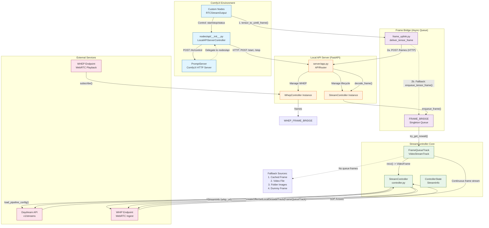

# RTC Stream Controller Tests

## Overview

This test suite validates the WHIP streaming functionality of the RTC controller, which manages real-time video frame streaming to the Daydream Live API.

## Test Structure

```
tests/
├── conftest.py                          # Shared fixtures and mocks
├── api/
│   └── test_http_server.py             # HTTP endpoint tests
├── controller/
│   ├── test_stream_controller.py       # StreamController lifecycle tests
│   └── test_frame_queue_track.py       # Frame routing & monotonicity tests
```

## Running Tests

```bash
# Run all tests
python run_tests.py tests/

# Run specific test file
python run_tests.py tests/api/test_http_server.py

# Run with verbose output
python run_tests.py tests/ -v
```

**Note**: The `run_tests.py` wrapper temporarily hides the root `__init__.py` to prevent pytest import conflicts with ComfyUI's relative imports.

## Architecture: Custom Nodes ↔ StreamController Data Flow



## Key Components

### 1. Frame Bridge (`FRAME_BRIDGE`)
- **Singleton async queue** connecting sync custom nodes to async StreamController
- Buffers frames when event loop isn't attached yet
- Max size: 90 frames (configurable)

### 2. StreamController
- Manages WHIP session lifecycle
- Loads pipeline config from JSON or dict override
- Polls Daydream stream status asynchronously
- Tracks frames sent via `FrameQueueTrack._pts`

### 3. FrameQueueTrack
- `aiortc.VideoStreamTrack` implementation
- **Frame source priority**:
  1. Live frames from `FRAME_BRIDGE.try_get_nowait()`
  2. Cached last live frame (prevents black frames)
  3. Fallback video file (loops)
  4. Folder images (`output/` directory)
  5. Dummy black frame
- **Monotonic PTS**: Always increments `_pts`, ensuring valid WebRTC stream

### 4. HTTP Endpoints (`server/app.py`)

| Endpoint | Method | Purpose |
|----------|--------|---------|
| `/start` | POST | Create Daydream stream & begin WHIP session |
| `/stop` | POST | Terminate streaming |
| `/status` | GET | Query controller state & remote status |
| `/frames` | POST | Push PNG-encoded frame (base64) |
| `/config` | GET/POST | Runtime settings (frame_rate, dimensions) |
| `/pipeline/cache` | POST | Persist pipeline config to disk |
| `/whep/connect` | POST | Subscribe to WHEP playback |
| `/whep/status` | GET | WHEP connection state |
| `/whep/frame` | GET | Latest received frame from WHEP |

### 5. ComfyUI Integration (`nodes/api/__init__.py`)

The `LocalAPIServerController` exposes `/rtc/control` on ComfyUI's `PromptServer`:

```python
POST /rtc/control
{
  "action": "start|stop|restart|status",
  "settings": { "host": "...", "port": 8895 }
}
```

This endpoint delegates to `server_manager.py` which spawns/stops the FastAPI server process.

## Test Coverage

### HTTP Server Tests (`test_http_server.py`)
- ✅ Health check
- ✅ Start/stop stream lifecycle
- ✅ Runtime config lock (prevents changes while streaming)
- ✅ Frame push (base64 PNG decode)
- ✅ Pipeline cache persistence
- ✅ WHEP connect/disconnect

### StreamController Tests (`test_stream_controller.py`)
- ✅ Start/stop lifecycle
- ✅ Restart behavior (cancel previous task)
- ✅ Failure handling (invalid credentials)
- ✅ Remote status throttling (3s minimum)
- ✅ Frame enqueue

### FrameQueueTrack Tests (`test_frame_queue_track.py`)
- ✅ Live frame delivery
- ✅ Cached frame replay
- ✅ Fallback sources (folder, dummy)
- ✅ **Monotonic PTS** across source switches
- ✅ Intermittent frame availability

## Mocking Strategy

1. **Torch**: Mocked in `conftest.py` before any imports
2. **Daydream API**: `mock_daydream_api` stubs `requests.post/get`
3. **RTCPeerConnection**: `mock_pc` provides async stubs for WebRTC
4. **Event Loop**: `bridge_loop` attaches running loop to `FRAME_BRIDGE`

## Known Issues

- Tests may hang if StreamController background tasks aren't properly cancelled
- `__init__.py` at project root conflicts with pytest imports (use `run_tests.py`)
- Some tests require `asyncio.sleep(0)` to yield control for mocked async operations

## Future Enhancements

1. **End-to-end CLI test**: Run `stream_whip.py` against mocked WHIP server
2. **Performance benchmarks**: Measure frame throughput under load
3. **Integration tests**: Real Daydream API calls (mark as `@pytest.mark.slow`)
4. **Coverage reporting**: Add `pytest-cov` and aim for >80%

